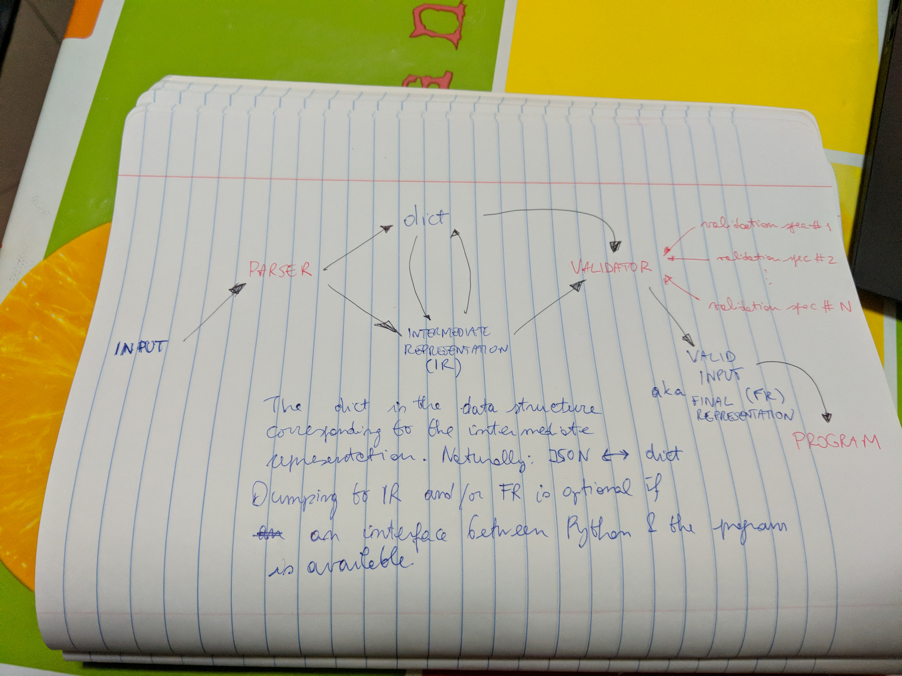
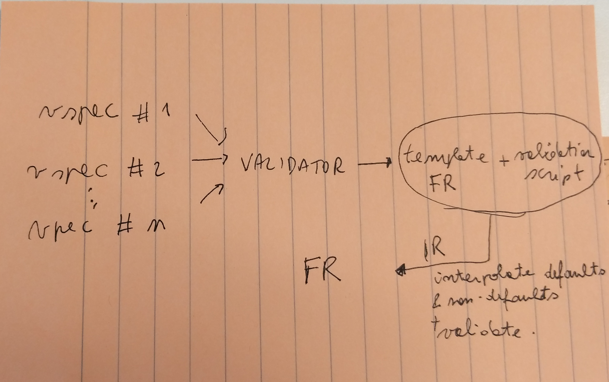

.. highlight:: shell

======
Design
======

This is an overview of our design choices, also outlining the scope of the library. See also `Issue #2`_.

   High-level overview of parselglossy and its components.

From parsing to validation, we outline two routes:

#. the lower one is file-based.
#. the upper one is "data-based", meaning that it relies on nested Python
   ``dict``-s rather than their file serialization. The upper route can bypass the
   ``PARSER`` element of the library and gives full scriptable access to setting
   input parameters.

Intermediate (IR) and Final (FR) Representations *must be* in formats that are
valid serializations of the Python ``dict`` data structure. `JSON`_ has been
temporarily chosen for the IR as the ``json`` module is part of the default Python
distribution, contrary to `YAML`_.
It is an open question whether we want to allow users of parselglossy to use
different formats for one or both the IR and the FR. While this is not an
insurmountable technical challenge, it does not seem to be a feature to die for.
Program authors will have to depend on an implementation of a serialized FR
reader. `JSON`_ again seems to be favorable as mature and actively maintained
implementations are available for all the major languages:

- For C++: https://github.com/nlohmann/json
- For C: https://jansson.readthedocs.io/en/latest/
- For Fortran: http://jacobwilliams.github.io/json-fortran/

To allow for its flexible use, the library will have two components the *parser*
and the *validator*. Assuming, but not requiring, that the code that needs input
parsing facilities is *scriptable*, these are some the scenarios we want to
tackle:

- **User** Writes an input file, runs a wrapper script to a program, gets an
  output. Program authors will have to interact with parselglossy to:

  #. Define the input grammar (``import parselglossy.parser``)
  #. Define the vspecs
  #. Define the combination of vspecs (``import parselglossy.validator``)

- **Power user** Writes a script with input options as a Python ``dict``. These
  are passed as-is to the ``VALIDATOR`` which fills in the gaps (defaults, missing
  required values and so forth) and then forwards for actual execution. Program
  authors will have to interact with parselglossy to:

  #. Orchestrate invocation of the ``VALIDATOR``.
  #. Forward the validated ``dict`` for execution.

   Relation between validation specifications, validator, and final representation.

.. _Issue #2: https://github.com/dev-cafe/parselglossy/issues/2
.. _JSON: https://www.json.org/
.. _YAML: https://yaml.org/
