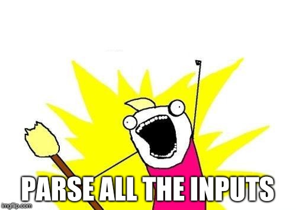

-

# Summary

Every sufficiently complicated software will let users customize its operations
by means of input parameters. This is most efficiently achieved by means of
input files. The need for input parsing facilities is ubiquitous.
Despite their fundamental role in the software stack, input parsers are
notoriously hard to maintain when software evolves.
This is especially true for scientific research software, which undergo constant
evolution and addition of new features.
Input parsing and validation of parameters can become a subtle source of bugs.
There is no mechanism, apart from coding discipline and rigorous code review, to
ensure and enforce that every combination of parameters leads to a meaningful
computational set up.
Furthermore, documentation of input parameters is entirely left to the
programmers' discipline and is, in our opinion, the fastest software component
to become outdated and rot. This is ironic: software, especially that tailored
to scientific research, is useless without clear documentation.
Complex computational workflows, where different software is used to perform a sequence of steps in a pipeline, have exposed and exacerbated the need for shared input/output formats.
Recently, there has been a push in domain-specific software towards reorganization of large, often legacy, code bases as collections of independent and interchangeable software libraries.
It is out of the question that this push has and continues to do much to improve overall code quality and scientific collaboration.
However, it has let another problem surface: how to transfer input between different modules? Input parsing is also inherently hard to compose.

`parselglossy` aims at providing modern, lightweight infrastructure for input
parsing that solves the problems outlined above. With `parselglossy` successful
parsing **always** means a valid calculation set up.

- the types of the input parameters are checked.
- meaningful error messages are emitted, listing **all** problems in the user input.
- syntax (format) and semantics (meaning) are separated and can be mixed without effort, making input parsing _composable_.
- the validated input is in standard [`JSON` format](https://www.json.org/). Any software, in any programming language can parse `JSON`.
- documentation of parameters **must** be specified for the parsing to even take place.

# Acknowledgements

The authors acknowledge Jonas Juselius for his earlier implementation of the
syntax-semantics split for input parsing in the [Getkw library](https://github.com/dev-cafe/libgetkw).

# References
